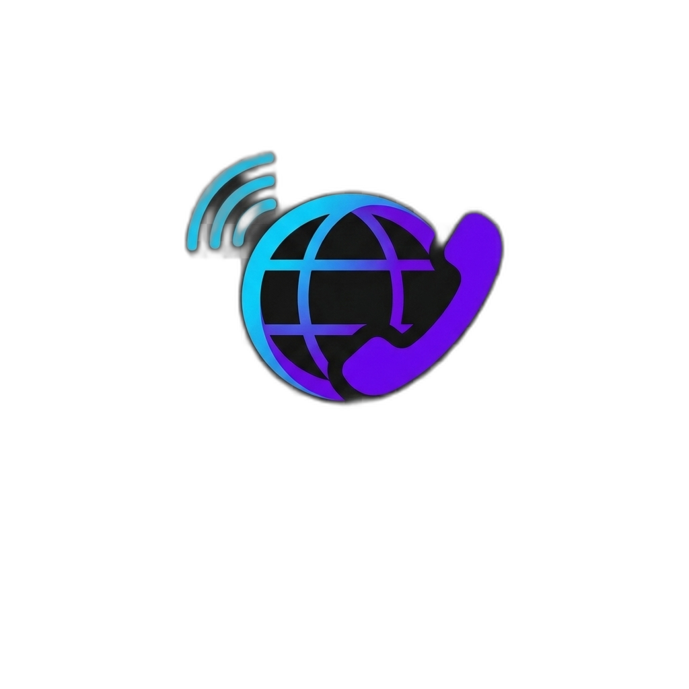

# 📞 phonex

<p align="center">
  
</p>

[](https://pkg.go.dev/github.com/bakhod1r/phonex)
[](https://github.com/bakhod1r/phonex/actions/workflows/ci.yml)
[](https://goreportcard.com/report/github.com/bakhod1r/phonex)
[](LICENSE)

A phone number parsing, validation and formatting library for Go.

**[Documentation](https://bakhod1r.github.io/phonex/)** ·
[API reference](https://pkg.go.dev/github.com/bakhod1r/phonex)

The metadata is generated directly from Google's
[libphonenumber](https://github.com/google/libphonenumber)
`PhoneNumberMetadata.xml`, so number ranges, formatting rules, trunk prefixes
and example numbers are the same ones the reference implementation uses.
Parsing an international number into an existing `Phone` performs **no
allocations**.

```go
p, err := phonex.Parse("+998 90 123 45 67")

p.E164()          // +998901234567
p.International() // +998 90 123 45 67
p.National()      // 90 123 45 67
p.Country()       // UZ
p.Type()          // MOBILE
p.IsValid()       // true
```

---

## Install

```sh
go get github.com/bakhod1r/phonex
```

Requires Go 1.26 or newer.

---

## 1. Parsing

```go
phonex.Parse("+998901234567")                                  // international
phonex.Parse("998901234567")                                   // no '+', calling code present
phonex.Parse("90 123 45 67", phonex.WithDefaultCountry("UZ"))  // national
phonex.Parse("011 44 20 7031 3000", phonex.WithDefaultCountry("US")) // dialled with an IDD
phonex.Parse("tel:+1-202-555-0123;ext=42")                     // RFC 3966
phonex.Parse("1-800-FLOWERS", phonex.WithDefaultCountry("US"), phonex.WithAlphaCharacters())
```

Punctuation, spacing and grouping characters are ignored. The trunk prefix is
stripped using the region's own rules, so `020 7031 3000` in `GB` and
`+44 20 7031 3000` produce the same number.

### Options

| Option | Effect |
| --- | --- |
| `WithDefaultCountry(region)` | Region assumed when the input carries no calling code. |
| `WithAlphaCharacters()` | Maps vanity letters to keypad digits (`FLOWERS` → `3569377`). |
| `WithoutRawInput()` | Drops the original string from the parsed number. |

`Parse` fails when no region can be determined, when the input holds
characters a number cannot, or when the digit count falls outside the bounds
E.164 sets for any number (2 to 17 digits).

It deliberately does **not** judge the number against its own country's rules.
A number of the wrong length for its region, or in an unassigned range, still
parses — so that `Possibility` can say *why* and `IsValid` can say whether it
is real. This mirrors libphonenumber. **Check `IsValid` before trusting a
parsed number.**

### Errors

Every failure is a `*ValidationError` and is comparable with `errors.Is`:

```go
_, err := phonex.Parse("+9989012")
errors.Is(err, phonex.ErrTooShort) // true
```

`ErrTooShort`, `ErrTooLong`, `ErrInvalidLength`, `ErrInvalidCountry`,
`ErrInvalidCountryCode`, `ErrMissingCountry`, `ErrInvalidCharacters`,
`ErrInvalidExtension`.

---

## 2. Validation

```go
p.IsPossible() // the digit count is one the numbering plan uses
p.IsValid()    // the number falls inside an assigned range
```

The distinction matters: `+1 000 000 0000` has the right shape for the US but
is not an assigned number, so it is *possible* but not *valid*. `IsValid` is
the check to gate on.

`Possibility` reports **why** a length check failed, without compiling any
pattern:

```go
p.Possibility()
// IS_POSSIBLE | IS_POSSIBLE_LOCAL_ONLY | TOO_SHORT | INVALID_LENGTH | TOO_LONG
```

`IsPossible` is true for `IS_POSSIBLE` and for `IS_POSSIBLE_LOCAL_ONLY`, since
both are lengths the plan really uses; call `Possibility` to tell them apart.

Lengths are judged against the region that owns the calling code, while
validity is judged against the region the number resolves to. That asymmetry
is libphonenumber's, and it is why a Curaçao-length number written with a
Bonaire prefix is possible but not valid.

Other checks:

```go
p.IsValidForRegion("BS")          // valid *and* belonging to that region
p.CanBeInternationallyDialled()   // reachable from abroad
```

---

## 3. Number types

```go
p.Type() // MOBILE, FIXED_LINE, FIXED_LINE_OR_MOBILE, TOLL_FREE,
         // PREMIUM_RATE, SHARED_COST, VOIP, PERSONAL_NUMBER,
         // PAGER, UAN, VOICEMAIL, UNKNOWN
```

with predicates for each: `IsMobile`, `IsLandline`, `IsFixedLineOrMobile`,
`IsTollFree`, `IsPremiumRate`, `IsSharedCost`, `IsVoIP`, `IsPager`, `IsUAN`,
`IsVoicemail`, `IsPersonalNumber`.

Many regions do not separate mobile from fixed-line ranges; those numbers
report `FIXED_LINE_OR_MOBILE` rather than guessing.

---

## 4. Formatting

```go
p, _ := phonex.Parse("+442070313000")

p.E164()             // +442070313000
p.International()    // +44 20 7031 3000
p.National()         // 020 7031 3000
p.RFC3966()          // tel:+44-20-7031-3000
p.OutOfCountry("US") // 011 44 20 7031 3000
p.OutOfCountry("GB") // 020 7031 3000
```

`Format(FormatE164 | FormatInternational | FormatNational | FormatRFC3966)`
selects one at runtime, and `AppendE164(dst []byte) []byte` writes into a
caller-supplied buffer without allocating.

E.164 is a stable identity for **valid** numbers: parse one, store `E164()`,
parse it again, and you get the same string back. That does not extend to
invalid numbers — nothing says where their digits end and a trunk prefix
begins, so `+358 0000000` legitimately comes back as `+358 000000`. Validate
before you store.

Grouping comes from the region's own rules, including regions that share a
calling code: a `+1 242` number is written the way the Bahamas writes it.

---

## 5. As-you-type formatting

```go
f := phonex.NewFormatter("US")
f.InputDigit('2') // 2
f.InputDigit('0') // 20
f.InputDigit('2') // 202
...
f.Input("5550123") // (202) 555-0123

f.RemoveLastDigit() // (202) 555-012
f.Clear()
```

Typed digits are never lost, only regrouped, which is the property an input
field needs.

---

## 6. Extensions

Extensions are recognised in free text and in RFC 3966 form:

```go
p, _ := phonex.Parse("+1 202 555 0123 ext. 4321")
p.Extension() // 4321
p.E164()      // +12025550123  (E.164 has no extension)
p.RFC3966()   // tel:+1-202-555-0123;ext=4321
```

Markers understood: `ext`, `extn`, `extension`, `x`, `#`, `~`, `anexo`,
`interno`, `ramal`, `int`, and `;ext=`.

---

## 7. Comparing numbers

```go
phonex.MatchNumbers("901234567", "+998901234567", phonex.WithDefaultCountry("UZ"))
// EXACT_MATCH
```

`MatchType` grades the correspondence: `EXACT_MATCH`, `NSN_MATCH` (national
numbers agree but a calling code is unconfirmed), `SHORT_NSN_MATCH` (one is a
suffix of the other), `NO_MATCH`.

`Equal` is the boolean form, and `EqualExact` additionally requires the two to
have been written identically.

---

## 8. Country metadata

```go
m, _ := phonex.Country("UZ")
m.Name, m.ISO3, m.DialCode, m.MinLength, m.MaxLength

phonex.CountryByDialCode("+1")     // US, the main region for +1
phonex.RegionsForDialCode("1")     // every region sharing +1
phonex.CountryByPhone("+442070313000")
phonex.SearchCountries("united")
phonex.SupportedRegions()          // 245 ISO-3166 alpha-2 codes
phonex.NonGeoEntities()            // +800, +808, +870, ...
```

Example numbers come from libphonenumber and are valid by construction:

```go
p, _ := phonex.ExampleNumberForType("GB", phonex.Mobile)
```

### Generating numbers

For test fixtures and demos, `Generate` builds a random number that `IsValid`
accepts, by keeping an example's area and operator digits and randomising the
subscriber part:

```go
phonex.Generate("GB")                        // random, prefers mobile
phonex.GenerateForType("GB", phonex.Mobile)  // a particular range
```

Both draw from the global `math/rand`. Where the output has to be reproducible
from a seed, supply the randomness instead — `intn` returns a value in
`[0,n)`, so any generator fits, and phonex is not tied to one:

```go
r := rand.New(rand.NewSource(1))
phonex.GenerateWith("GB", phonex.Mobile, r.Intn)  // same seed, same number
phonex.GenerateWith("GB", phonex.AnyType, r.Intn) // any range the region has
```

To generate around a code you already know — an area or operator prefix —
give it to `GenerateForPrefix`:

```go
phonex.GenerateForPrefix("GB", "20", r.Intn)   // +44 20 xxxx xxxx, London
phonex.GenerateForPrefix("UZ", "93", r.Intn)   // +998 93 xxx xx xx, Ucell
```

The prefix may be written either way round. National number lengths vary
within a country — London's `20` takes eight further digits where most UK
codes take seven — and some plans count the trunk digit as part of the
national number, so Rome is `06` to phonex and `6` in an atlas. Both readings
are tried, and the shape that fits is cached. It reports false when no shape
the plan defines accepts the prefix.

> Generated numbers are valid, which means they may well belong to a real
> subscriber. Never dial or message them.

---

## 9. Storage and encoding

`Phone` implements `json.Marshaler`, `json.Unmarshaler`,
`encoding.TextMarshaler`, `encoding.TextUnmarshaler`, `sql.Scanner` and
`driver.Valuer`. Everything round-trips through E.164, and anything that does
not parse is rejected, so a stored `Phone` is never invalid.

```go
type User struct {
    Phone *phonex.Phone `json:"phone"`
}
// {"phone":"+998901234567"}
```

---

## 10. Privacy helpers

```go
p.Mask()                  // +998*******67
p.Mask(phonex.MaskLast4)  // *********4567
phonex.Redact(p)          // +998*******67

p.Hash()                            // SHA-256 of the E.164 form
phonex.Fingerprint(p, phonex.WithSecret(key)) // HMAC-SHA256
```

Hashes are computed over the canonical E.164 form, so the same number written
differently hashes alike.

---

## 11. Short numbers

Short numbers — `112`, `911`, `10086` — have no international form and no
calling code, and the same digits mean different things in different
countries. `Parse` rejects them as too short. They live in their own package,
which carries its own metadata so a program that never asks about them does
not link half a megabyte of tables:

```go
import "github.com/bakhod1r/phonex/shortnumber"

shortnumber.IsEmergency("112", "GB")           // true
shortnumber.IsEmergency("112", "UZ")           // false — Uzbekistan dials 02
shortnumber.ConnectsToEmergency("911123", "US") // true
shortnumber.IsValid("100", "GB")               // true, the BT operator
shortnumber.ExpectedCost("10086", "CN")        // STANDARD_RATE
shortnumber.IsCarrierSpecific("454 00", "UZ")  // true
```

Every call takes the region, because without it the digits mean nothing, and
the digits are read exactly as dialled — no trunk prefix rules are applied.

`IsEmergency` requires an exact match. `ConnectsToEmergency` also accepts
digits typed after the emergency number, because that is what the network
acts on; in Brazil, Chile and Nicaragua, where it does not, it reports false.
Use `ConnectsToEmergency` when deciding whether a number is safe to dial.

---

## 12. Where a number is, and whose it is

Three optional packages answer questions the core metadata cannot, each from
its own data set:

```go
import (
    "github.com/bakhod1r/phonex/geocoding"
    "github.com/bakhod1r/phonex/carrier"
    "github.com/bakhod1r/phonex/timezone"
)

p, _ := phonex.Parse("+44 20 7031 3000")
geocoding.Area(p)     // "London"
geocoding.Describe(p) // "London", or the country name when there is no area
timezone.For(p)       // ["Europe/London"]

q, _ := phonex.Parse("+44 7400 123456")
carrier.Name(q)            // "Three" — the network the range was issued to
carrier.SafeDisplayName(q) // "" — Britain has number portability
timezone.For(q)            // ["Europe/Guernsey" "Europe/Isle_of_Man" "Europe/London"]
```

**Read the answers for what they are.** All three key off the number's prefix,
so they describe where and how the number was *issued*, not where its owner is
or which network it is on today. A mobile number keeps its area and time zone
when its owner emigrates, and in a country with number portability the carrier
name can be years out of date — which is why `SafeDisplayName` returns nothing
there rather than something misleading.

### A note on carrier lookup

Getting the network from a number is the most frequently asked of the three,
and the one most often misread, so it is worth being precise about what it
gives you.

```go
p, _ := phonex.Parse("+998 93 123 45 67")
carrier.Name(p)                                  // "Ucell"
carrier.NameForDigits("998931234567")            // "Ucell", without parsing
carrier.NameForNumber("93 123 45 67", "UZ")      // "Ucell", in one step
carrier.SafeDisplayName(p)                       // "Ucell" — see below
carrier.Count()                                  // 28962 prefixes
```

The answer comes from a prefix table, which has three consequences worth
knowing before you show it to anyone:

**It is the network the range was issued to, not the one serving the number
today.** Where subscribers can keep their number when they switch operator,
the table cannot know they did. `Name` still returns the original network;
`SafeDisplayName` returns `""` in those regions instead, and is the one to use
for anything a user will read. Uzbekistan is not among them, so both agree
there.

**Coverage is uneven, and the gaps are deliberate.** The data set covers 206
calling codes, but only the ranges upstream is confident about. There are no
entries for United States or Russian mobile numbers at all — portability there
makes a prefix table close to meaningless — so `Name` returns `""` for them.
An empty result means "not in the data", never "no such carrier".

**Only mobile ranges are covered.** A fixed line returns `""`, because a
landline belongs to whoever operates the exchange rather than to a network in
this sense.

For Uzbekistan the whole mobile table is short enough to print:

| Prefix | Carrier |
| --- | --- |
| 33 | HUMANS |
| 50, 93, 94 | Ucell |
| 77, 95, 99 | Uzbektelecom |
| 88, 97 | MobiUZ |
| 90, 91 | Beeline |
| 98 | Perfectum |

Anything else — `+998 59 …`, say — is not an assigned range, and `IsValid`
reports that before carrier lookup becomes a question.

A lookup takes about 150 ns and allocates nothing.

### Why these are separate packages

They are separate packages because the data is large and most programs need
none of it. A hello-world binary, built with Go 1.26 on darwin/arm64:

| Imports | Binary |
| --- | --- |
| `phonex` alone | 3.8 MB |
| `+ timezone` | 3.9 MB |
| `+ carrier` | 4.1 MB |
| `+ geocoding` | 7.2 MB |
| all of them, plus `shortnumber` | 7.9 MB |

Geocoding and carrier data is English only.

---

## 13. Batch helpers

```go
phonex.ParseMany(numbers, opts...)  // one Result per input, order preserved
phonex.Unique(numbers)              // distinct E.164 numbers, first-seen order
phonex.SortNumbers(numbers)         // sorted E.164 numbers
```

---

## Performance

Apple M4 Pro, Go 1.26, `-benchtime` defaults, median of three runs:

```
BenchmarkParseInternational-12       18116932     55.7 ns/op      0 B/op    0 allocs/op
BenchmarkParseSharedCallingCode-12    2408018    493.6 ns/op      0 B/op    0 allocs/op
BenchmarkParseNational-12             3283627    365.3 ns/op     16 B/op    1 allocs/op
BenchmarkParseAllocating-12          14347630     82.5 ns/op    112 B/op    1 allocs/op
BenchmarkIsValid-12                   3400000    343.0 ns/op    112 B/op    1 allocs/op
BenchmarkE164-12                     54000000     21.8 ns/op     16 B/op    1 allocs/op
BenchmarkAppendE164-12              257336388      4.4 ns/op      0 B/op    0 allocs/op
BenchmarkFormatNational-12            1400000    834.4 ns/op    178 B/op    9 allocs/op
BenchmarkGeocodingArea-12             7881004    150.4 ns/op      0 B/op    0 allocs/op
```

The geocoding lookup is a binary search over 269379 prefixes, probed from the
longest down, and it allocates nothing.

Reading those: a number in international form costs one array lookup and a
length check. A shared calling code such as `+1` costs more because the region
has to be identified by matching the national number against candidate ranges,
which is inherent — libphonenumber does the same work. The one remaining
allocation on the national path is the submatch index slice the regexp engine
returns while stripping a trunk prefix, and it only affects the 44 regions
whose prefix rule is a pattern rather than a literal.

Three things make that possible:

- **Constant-time calling-code lookup.** Calling codes are indexed by their
  numeric value in fixed-size arrays, not scanned across a map of regions.
- **Inline storage.** A `Phone` keeps its digits and its parsing scratch
  buffer inside the struct, so parsing into an existing value never touches
  the heap.
- **Lazily compiled patterns.** The ~2500 metadata patterns are compiled on
  first use, so start-up stays cheap and a program that only ever sees
  Uzbek numbers never compiles Brazil's.

For hot loops, reuse a `Phone` and pass options as a struct so the variadic
option slice is not built per call:

```go
var p phonex.Phone
opts := phonex.DefaultParseOptions()
opts.DefaultCountry = "UZ"
opts.KeepRawInput = false

for _, s := range numbers {
    if err := p.ParseWith(s, opts); err == nil {
        use(p.E164())
    }
}
```

A `Phone` is not safe for concurrent modification. Metadata is immutable and
safe to read from any goroutine.

---

## Metadata

Every table under `countries/`, `shortnumber/`, `timezone/`, `carrier/` and
`geocoding/` is produced by `cmd/phonexgen` from the data vendored under
`internal/metadata/` — libphonenumber **v9.0.32**, verbatim — plus
`internal/metadata/metadata.json`, which supplies the ISO-3166 alpha-3 codes,
English country names and time zones that libphonenumber does not carry.

The data is pinned to a tagged release rather than to `master`, so an update
is a deliberate, reviewable step. Each generated package exports a
`SourceHash` recording the SHA-256 of the exact data it was built from, and a
test in each fails if the two drift apart.

```sh
make generate         # regenerate from the vendored XML
make update-metadata  # fetch the pinned release, regenerate, run everything
```

Bump `METADATA_VERSION` in the `Makefile` to move to a newer release.

Review the diff before committing an upstream refresh: it changes number
ranges, not only formatting.

The test suite parses every example number in the metadata — around 1200
across 245 regions — and asserts that each one is valid, resolves to the range
it was listed under, and survives a round trip through the national,
international and RFC 3966 formats.

---

## Not included

- **Languages other than English** for geocoding and carrier names. Upstream
  ships 34 and 10 respectively; vendoring them all would multiply the data.
  The generator takes the directory as a flag, so adding one is a matter of
  vendoring it and generating a second package.
- **`Metadata.Timezones`**, the country-level field on the region metadata,
  is empty. Use the `timezone` package, which is prefix-level and far more
  precise.

---

## Differential testing

`difftest/` is a separate module that compares phonex against Google's
libphonenumber, through the [nyaruka/phonenumbers](https://github.com/nyaruka/phonenumbers)
port, over 12785 ordinary numbers across all 245 regions and 8044 short
numbers across 241 — every example number in the metadata, in international
and national form, plus pseudo-random numbers in each region's shape. It is a
separate module so that phonex itself keeps no dependencies.

```sh
make diff
```

Current agreement:

| Check | Result |
| --- | --- |
| Accept / reject | no disagreement |
| E.164 output | no disagreement |
| Resolved region | no disagreement |
| Number type | no disagreement |
| `IsPossible` | no disagreement |
| `OutOfCountry` | no disagreement |
| Short: `IsEmergency`, `ConnectsToEmergency` | no disagreement |
| Short: `IsPossible`, `IsValid` | no disagreement |
| `geocoding.Area`, `timezone.For` | no disagreement |
| `carrier.Name` | 12 of 12784 |
| `IsValid` | 1 of 12784 |
| `International` / `National` / `RFC3966` | 6 of 4948 each |

The residual cases are data skew, not logic: phonex is generated from
libphonenumber v9.0.32, while nyaruka bundles data regenerated from snapshots
taken at other moments, so a handful of ranges, formats and carrier names
genuinely differ between the two sets. Ghana's AirtelTigo has rebranded to
"AT" in ours, for instance. The test prints every disagreement and fails if
the count grows, so a real regression appears as new cases.

Building it caught four real bugs that the unit tests did not:

- Trunk prefixes were not stripped from numbers written in international form,
  so `+44 (0)20 7031 3000` kept its `0`.
- The region was resolved by preferring the caller's default country, where
  libphonenumber always lets the number itself decide.
- `RFC3966` only replaced spaces, leaving New Caledonia's `20.12.34` intact.
- The national prefix rule was spliced onto a literal `$1`, but Argentina's
  mobile format is `$2 15-$3-$4` and has no `$1`, so the trunk prefix was lost.

It also caught three smaller ones: `IsPossible` rejected local-only lengths
that libphonenumber accepts, length was judged against the resolved region
rather than the region that owns the calling code, and a carrier selection
code was dropped in regions whose trunk prefix rule also rewrites the number.

---

## Maturity

Verified on every commit by CI:

- Every example number in the metadata (~1200 across 245 regions) parses,
  validates, and resolves to the range it was listed under, and every short
  number example is recognised in its own region.
- Every generated table matches the data vendored beside it.
- Every region's example survives a round trip through the national,
  international and RFC 3966 formats.
- Differential agreement with libphonenumber over 12785 inputs (see above).
- `go test -race` is clean, including a test that hammers one finished `Phone`
  from sixteen goroutines.
- Fuzzing, with no panic and no round-trip failure (11M executions locally,
  two minutes per CI run).
- `go vet` and `gofmt` clean, and a check that the generated metadata tables
  match the vendored XML.
- Statement coverage: 93.1% for `phonex`, 91.9% for `shortnumber`, and 100%
  for `geocoding`, `carrier`, `timezone` and the two internal packages.

What it has **not** been through: a tagged release or production traffic. The
API is still v0 and may change.

---

## Contributing

Bug reports and pull requests are welcome. [CONTRIBUTING.md](CONTRIBUTING.md)
covers the two things particular to this repository: which files are
generated and must not be edited by hand, and the differential test a change
has to survive. Vulnerabilities go through [SECURITY.md](SECURITY.md), not the
issue tracker.

## Licence

phonex is released under the MIT licence; see [LICENSE](LICENSE).

The phone number metadata, and the geocoding, carrier and time zone data, are
taken verbatim from Google's libphonenumber and remain under the Apache
License 2.0. Redistributing phonex therefore means keeping [NOTICE](NOTICE),
which records what is vendored and where it came from.
